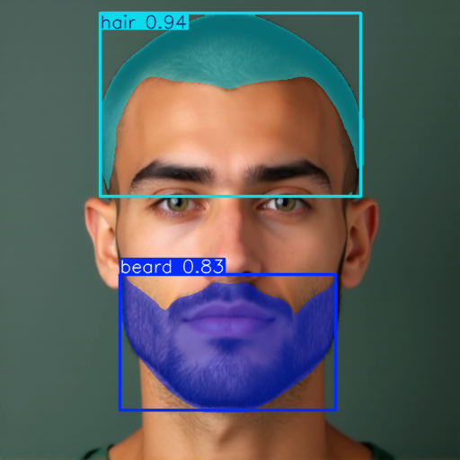

# Beard2NonBeard Facial Image Transformation

This project proposes a dataset creation pipeline, pipeline creates facial images with a beard and converts them to facial images of the same identity, pose, facial expression, and structure without a beard. The pipeline leverages a rule-based facial image description generator, text-to-image models, a text-to-image control model, and an inpainting model to achieve this transformation. Also pipeline includes a simple pix2pix training for beard2nonbeard facial image transformation. Once dataset created, you can use [this repository](https://github.com/Oguzhanercan/Generative-Vision-Modeling) to train better models.

## Pipeline Overview

The Beard2NonBeard pipeline, illustrated in Figure 1, consists of the following components:
- **Rule-based facial image description generator**: Generates textual descriptions of facial images.
- **Text-to-image models**: Utilized for generating initial image transformations ([Ref 1], [Ref 2]).
- **Text-to-image control model**: Guides the transformation process ([Ref 3]).
- **Inpainting model**: Refines the output by removing beard regions ([Ref 4]).





## Training

Using the pipeline, 5000 image pairs (bearded and non-bearded) were generated to train a simple auto-encoder. The Image to image model is based on a simple Pix2Pix ([Ref 5]), The model was trained for 100 epochs with the following settings:
- **Optimizer**: Adam with a learning rate of 1e-4.
- **Loss Function**: L1 loss (despite L2 loss being common in image reconstruction tasks, L1 was chosen based on prior work suggesting L2 approximates L1).

The training loss is shown in Figure 2.


### Evaluation

Training results were evaluated using **SSIM** (Structural Similarity Index) and **PSNR** (Peak Signal-to-Noise Ratio), as shown in Figures 3 and 4. These metrics were selected due to their commonality in image reconstruction tasks and the limited computational resources available, which made computing more complex metrics like FID or LPIPS impractical.


### Model inputs


### Model outputs


## Future Work

To improve model performance, the following strategies could be explored:
- Learning rate scheduling and warmups.
- Advanced optimizers (e.g., SGD-SAL, Apollo, Muon, SOAP, CMA).
- Knowledge distillation.
- Identity-preserving loss (e.g., ArcFace).
- Fine-tuning a model with prior knowledge of face reconstruction.

## Installation

### 1. Create a Virtual Environment
```bash
python3 -m venv venv
source venv/bin/activate  # On Windows: venv\Scripts\activate
```

### 2. Install Required Packages
```bash
pip install -r installation/requirements.txt
```

### 3. Download and Place Model Files
```bash
cd installation
bash download_models.sh
```

### 4. Folder Structure
The expected folder structure for the models is shown in `installation/folder_structure.png`.

## References
1. [Black Forest Labs](https://blackforestlabs.ai/announcing-black-forest-labs/)
2. [Text-to-Image Model](https://arxiv.org/abs/2112.10752)
3. [Text-to-Image Control Model](https://arxiv.org/abs/2302.05543)
4. [Inpainting Model](https://arxiv.org/abs/2411.09703)
5. [Pix2Pix](https://arxiv.org/abs/1611.07004)

## Author
Oğuzhan Ercan
